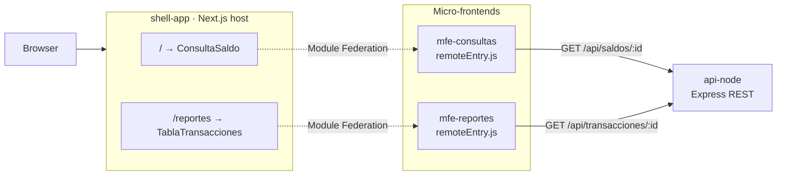
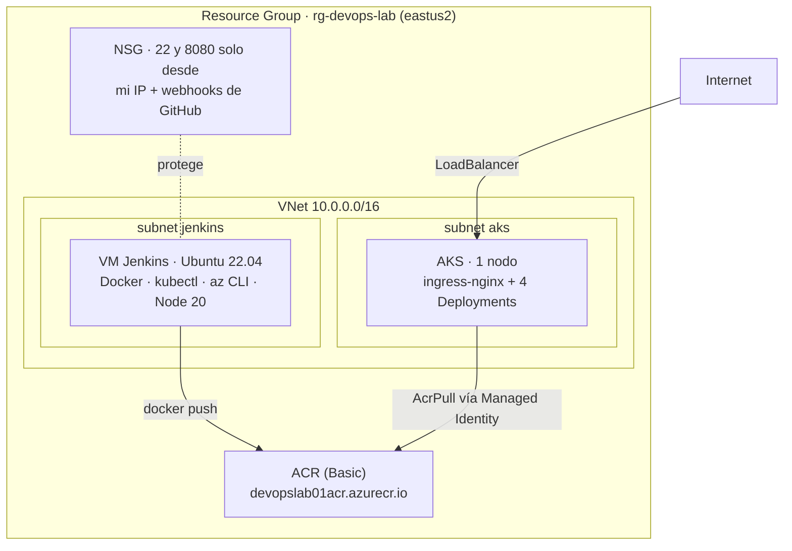
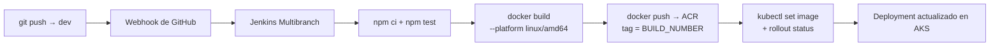

# POC DevOps — Micro-frontends sobre Azure con CI/CD en Jenkins

Laboratorio end-to-end que lleva una arquitectura de **micro-frontends** desde el
código hasta un clúster de **Kubernetes en Azure**, con la infraestructura
declarada en **Terraform** y un pipeline de **CI/CD en Jenkins** que despliega
solo con un `git push`.

No es un "hello world con Docker": incluye Module Federation en runtime, un
registry privado, Ingress con reglas de rewrite, health probes, y un runbook con
los 11 problemas reales que hubo que resolver para que funcionara.

> **Estado:** infraestructura destruida (`terraform destroy`) — el laboratorio
> cumplió su objetivo y se cerró para no seguir facturando. Todo es
> reproducible desde cero con los comandos del
> [RUNBOOK](https://github.com/Rxcxrdx/infra-devops-lab/blob/main/RUNBOOK.md).

---

## Los repositorios

Cada componente vive en su propio repositorio: es lo que hace que el CI/CD
multi-repo de Jenkins (un job Multibranch + un webhook por aplicación) tenga
sentido real y no sea una simulación.

| Repositorio | Qué es | Stack |
|---|---|---|
| [infra-devops-lab](https://github.com/Rxcxrdx/infra-devops-lab) | Infraestructura Azure + manifiestos de Kubernetes + RUNBOOK | Terraform, AKS, ACR, cloud-init |
| [api-node](https://github.com/Rxcxrdx/api-node) | API REST de saldos y transacciones (datos mock, sin BD) | Node.js, Express, TypeScript, Jest |
| [shell-app](https://github.com/Rxcxrdx/shell-app) | Host de micro-frontends que compone los remotes | Next.js 14, Module Federation |
| [mfe-consultas](https://github.com/Rxcxrdx/mfe-consultas) | Remote que expone `ConsultaSaldo` | React, Webpack 5 MF, Testing Library |
| [mfe-reportes](https://github.com/Rxcxrdx/mfe-reportes) | Remote que expone `TablaTransacciones` | React, Webpack 5 MF, Testing Library |

---

## Arquitectura de aplicación

El navegador carga el shell, y el shell descarga en runtime el `remoteEntry.js`
de cada micro-frontend. Cada remote consulta la API por su cuenta.



Los micro-frontends se despliegan y versionan de forma **independiente**: un
cambio en `mfe-reportes` no obliga a reconstruir el shell ni las otras apps.

---

## Infraestructura en Azure

Todo se levanta con `terraform apply` desde
[infra-devops-lab](https://github.com/Rxcxrdx/infra-devops-lab): 12 recursos,
dimensionados al mínimo para contener el costo del laboratorio.



El acceso de AKS al registry es por **Managed Identity** con rol `AcrPull`, no
por credenciales embebidas en un secret de Kubernetes.

---

## Pipeline CI/CD

Cada uno de los 4 repos de aplicación tiene su propio `Jenkinsfile` y su job
Multibranch. Un push a `dev` dispara el pipeline por webhook, sin tocar Jenkins.



Detalles que importan:

- Los stages de **push y deploy corren solo en la rama `dev`**; en cualquier otra
  rama el pipeline se queda en build y test (feedback rápido sin ensuciar el registry).
- Las imágenes se etiquetan con el `BUILD_NUMBER`, así que `kubectl set image`
  apunta a un tag inmutable y el rollback es un `kubectl rollout undo`.
- Las credenciales del ACR y el kubeconfig se inyectan con `withCredentials` /
  `withKubeConfig` — nunca están en el repositorio.
- `kubectl rollout status --timeout=180s` hace que el pipeline **falle** si el
  despliegue no converge, en vez de reportar verde en falso.

---

## Correr todo en local

La forma más rápida de ver el sistema funcionando, sin Azure y sin costo:

```bash
git clone https://github.com/Rxcxrdx/POC-DEVOPS.git
cd POC-DEVOPS

# Clonar las 4 aplicaciones como carpetas hermanas
for r in api-node shell-app mfe-consultas mfe-reportes; do
  git clone "https://github.com/Rxcxrdx/$r.git"
done

docker compose up --build
```

| Servicio | URL |
|---|---|
| shell-app | http://localhost:3000 |
| api-node | http://localhost:3001/health |
| mfe-consultas | http://localhost:3002/remoteEntry.js |
| mfe-reportes | http://localhost:3003/remoteEntry.js |

Abre http://localhost:3000 — `/` muestra el saldo, `/reportes` la tabla de
transacciones, cada uno servido por un micro-frontend distinto.

---

## Desplegar en Azure

Requisitos: Terraform >= 1.7, Azure CLI autenticado, una clave SSH **RSA**
(Azure rechaza ed25519 en las VMs) y una suscripción activa.

```bash
cp env.sh.example env.sh   # y rellenar con tu Service Principal
source env.sh

cd infra-devops-lab
cp terraform.tfvars.example terraform.tfvars   # ajustar my_ip
terraform init && terraform apply
```

El paso a paso completo — incluido el despliegue de las apps, la instalación de
ingress-nginx, la configuración de Jenkins y cómo apagar todo — está en el
[RUNBOOK](https://github.com/Rxcxrdx/infra-devops-lab/blob/main/RUNBOOK.md).

> ⚠️ Esto **genera cargos en Azure** mientras los recursos existan. Al terminar:
> `terraform destroy`.

---

## Problemas reales que hubo que resolver

Lo más valioso del laboratorio. Los 11 están documentados en el
[RUNBOOK](https://github.com/Rxcxrdx/infra-devops-lab/blob/main/RUNBOOK.md#gotchas-ya-resueltos-no-perder-tiempo-redescubriéndolos);
estos tres fueron los que más costaron:

**1. Las URLs de los micro-frontends se hornean en build, no en runtime.**
El primer despliegue cargaba las páginas en blanco. `shell-app` (vía
`next.config.js`) y los remotes (vía `webpack.DefinePlugin`) resuelven las URLs
de sus dependencias **en el momento del `docker build`**, no las leen del
entorno al arrancar. Ponerlas como `env:` en el Deployment de Kubernetes no
hacía absolutamente nada. Además tienen que ser URLs que **el navegador** pueda
resolver — la IP pública del Ingress, jamás un nombre de `Service` interno.

**2. Un solo Ingress con `rewrite-target` rompía Next.js.**
`/api`, `/consultas` y `/reportes` necesitan que se les quite el prefijo antes
de llegar al backend; `shell-app` necesita ver la ruta completa para servir sus
assets bajo `/_next/...`. Con un Ingress único, el rewrite se aplicaba a todo y
el shell quedaba sin CSS ni JS. La solución fue separarlo en **dos recursos
Ingress**: uno con rewrite + regex, otro sin rewrite para la raíz.

**3. AKS con `network_plugin = "azure"` pisaba el rango de la propia VNet.**
Azure asigna por defecto `service_cidr = 10.0.0.0/16`, exactamente el de
nuestra VNet → `ServiceCidrOverlapExistingSubnetsCidr`. Hay que fijar
`service_cidr` y `dns_service_ip` explícitamente (se usó `172.16.0.0/16`).

Los otros ocho incluyen: Azure exigiendo SSH RSA, el tamaño `Standard_B2s`
bloqueado para la suscripción, builds cruzados arm64 → amd64 desde Apple
Silicon, Jenkins LTS requiriendo Java 21, y el GitHub Branch Source plugin que
solo acepta credenciales tipo "Username with password".

---

## Stack

**Infraestructura** · Terraform · Azure (AKS, ACR, VNet, NSG, Managed Identity) · cloud-init
**Contenedores** · Docker (multi-stage, non-root) · Kubernetes (Deployments, Services, Ingress, probes, resource limits) · ingress-nginx
**CI/CD** · Jenkins (Declarative Pipeline, Multibranch, webhooks, credentials)
**Aplicación** · TypeScript · Node.js · Express · Next.js 14 · React · Webpack 5 Module Federation
**Testing** · Jest · Supertest · React Testing Library

---

## Notas de seguridad

Este es un laboratorio, y algunas decisiones lo reflejan de forma consciente:

- La API **no tiene autenticación** y sirve datos mock; `cors()` está abierto.
- El **usuario admin del ACR está habilitado** para simplificar el login desde
  Jenkins. En un entorno real: un Service Principal o `az acr login` con AAD.
- **AKS corre con un solo nodo**, sin alta disponibilidad ni zonas.
- El NSG restringe SSH y Jenkins (8080) a una sola IP más los rangos de
  webhooks de GitHub; Jenkins queda sobre HTTP, sin TLS.

Ningún secreto vive en estos repositorios: `terraform.tfstate`, `terraform.tfvars`,
el kubeconfig y `env.sh` están en `.gitignore`, y las credenciales del pipeline
se administran desde el credential store de Jenkins.
