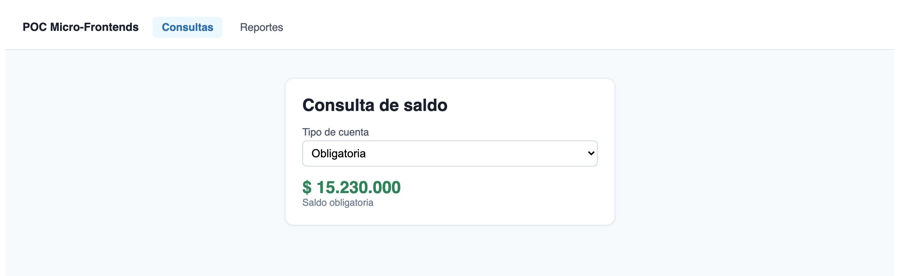
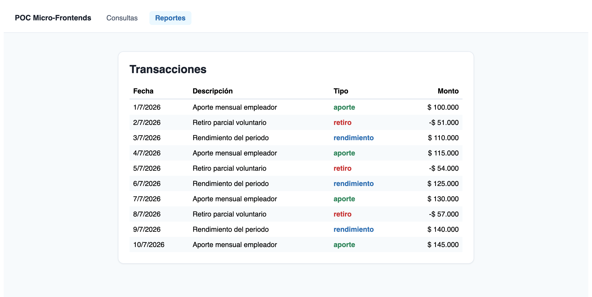
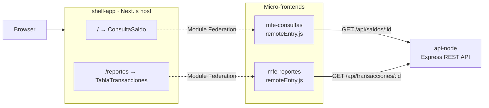
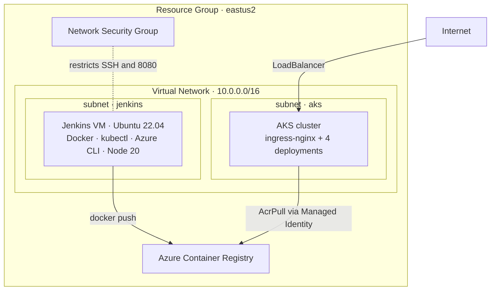
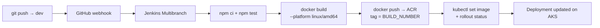

<h1 align="center">Micro-Frontends on Azure AKS</h1>

<p align="center">
  <strong>A production-shaped micro-frontend platform deployed to Kubernetes on Azure,<br/>
  with infrastructure as code and a multi-repo CI/CD pipeline.</strong>
</p>

<p align="center">
  
  
  
</p>

<p align="center">
  
  
  
  
  
  
  
  
  
</p>

---

## 📑 Table of Contents

- [About the Project](#-about-the-project)
- [Demo](#-demo)
- [Project Status](#-project-status)
- [Repositories](#-repositories)
- [Features](#-features)
- [Architecture](#-architecture)
  - [Application Layer](#application-layer)
  - [Azure Infrastructure](#azure-infrastructure)
  - [CI/CD Pipeline](#cicd-pipeline)
- [Getting Started](#-getting-started)
  - [Run Locally](#run-locally)
  - [Deploy to Azure](#deploy-to-azure)
- [Tech Stack](#-tech-stack)
- [Security Notes](#-security-notes)
- [Author](#-author)
- [License](#-license)

---

## 📖 About the Project

This project takes a **micro-frontend architecture** all the way from source code
to a running **Kubernetes cluster on Azure**, with every piece of infrastructure
declared in **Terraform** and deployments triggered by a single `git push`.

The application is a small banking-style dashboard: a Next.js host application
composes two independently deployable micro-frontends at runtime through
**Webpack 5 Module Federation**, and both consume a shared REST API.

What makes it more than a container demo:

- Six repositories, each with its own lifecycle, versioning, and pipeline
- Runtime composition — the host downloads each remote's `remoteEntry.js` in the
  browser, so a micro-frontend can ship without rebuilding the host
- A private container registry accessed through **Managed Identity**, not
  credentials stored in a Kubernetes secret
- Ingress routing that handles path rewriting and Next.js asset paths correctly
- Health probes, resource limits, and a pipeline that fails when a rollout
  does not converge

---

## 🖼 Demo

Both screens are rendered by the same host application, but the content of each
comes from a **different micro-frontend**, loaded in the browser at runtime and
fetching its own data from the API.

**`/` — balance view, served by `mfe-consultas`**



**`/reportes` — transactions view, served by `mfe-reportes`**



The navigation bar and layout belong to the host. Everything inside the card is
remote code: the host never imports these components at build time — it
resolves them over the network when the route is visited.

---

## 🚦 Project Status

> **Completed — infrastructure decommissioned.**
> All three phases were delivered: infrastructure provisioning, manual
> deployment, and end-to-end CI/CD with Jenkins. The Azure resources were then
> destroyed with `terraform destroy` to stop billing. Everything is fully
> reproducible from scratch with the commands in this README.

| Phase | Scope | Status |
|:--|:--|:--:|
| 1 | Terraform infrastructure on Azure (AKS, ACR, VNet, NSG, Jenkins VM) | ✅ |
| 2 | Manual deployment of the four applications to Kubernetes | ✅ |
| 3 | Jenkins CI/CD — build, test, push, and deploy on every commit | ✅ |

---

## 📦 Repositories

Each component lives in its own repository. That separation is what makes the
multi-repo CI/CD model meaningful: every application owns its `Jenkinsfile`, its
Multibranch job, and its GitHub webhook.

| Repository | Description | Stack |
|:--|:--|:--|
| [**infra-devops-lab**](https://github.com/Rxcxrdx/infra-devops-lab) | Azure infrastructure and Kubernetes manifests | Terraform · AKS · ACR · cloud-init |
| [**api-node**](https://github.com/Rxcxrdx/api-node) | REST API serving account balances and transactions | Node.js · Express · TypeScript · Jest |
| [**shell-app**](https://github.com/Rxcxrdx/shell-app) | Host application that composes the micro-frontends | Next.js 14 · Module Federation |
| [**mfe-consultas**](https://github.com/Rxcxrdx/mfe-consultas) | Remote exposing the `ConsultaSaldo` component | React · Webpack 5 · Testing Library |
| [**mfe-reportes**](https://github.com/Rxcxrdx/mfe-reportes) | Remote exposing the `TablaTransacciones` component | React · Webpack 5 · Testing Library |

---

## ✨ Features

| | Feature | Description |
|:--:|:--|:--|
| 🧩 | **Runtime composition** | The host resolves and loads remotes in the browser through Module Federation — no rebuild of the host when a remote changes |
| 🚀 | **Independent deployments** | Each micro-frontend is built, versioned, and released on its own schedule |
| 🏗️ | **Infrastructure as code** | Twelve Azure resources provisioned by a single `terraform apply` |
| 🔄 | **Automated CI/CD** | A push to `dev` runs tests, builds an image, pushes it to the registry, and rolls out the deployment |
| 🔐 | **Credential-free registry access** | AKS pulls images via Managed Identity with the `AcrPull` role |
| 🛡️ | **Graceful degradation** | Each remote is wrapped in an error boundary, so one failing micro-frontend does not take down the page |
| 🩺 | **Health probes** | Liveness and readiness probes plus CPU and memory limits on every deployment |
| 🐳 | **Hardened images** | Multi-stage builds running as a non-root user |

---

## 🏛 Architecture

### Application Layer

The browser loads the host, which then downloads each micro-frontend's
`remoteEntry.js` at runtime. Each remote calls the API independently.



### Azure Infrastructure

Twelve resources, sized to the minimum to keep lab costs down.



### CI/CD Pipeline

Each application repository has its own `Jenkinsfile` and Multibranch job. A push
to `dev` triggers the pipeline through a GitHub webhook.



Design decisions worth noting:

- **Push and deploy stages run only on `dev`.** Other branches stop after build
  and test, giving fast feedback without polluting the registry.
- **Images are tagged with the build number**, so `kubectl set image` always
  points at an immutable tag and rollback is a single `kubectl rollout undo`.
- **Credentials are injected at runtime** through `withCredentials` and
  `withKubeConfig` — never committed to a repository.
- **`kubectl rollout status --timeout=180s`** makes the pipeline fail when a
  deployment does not converge, instead of reporting a false success.

---

## 🚀 Getting Started

### Run Locally

The fastest way to see the system working — no Azure account, no cost.

**Prerequisites:** Docker and Docker Compose.

```bash
# 1. Clone this repository
git clone https://github.com/Rxcxrdx/microfrontends-aks-jenkins.git
cd microfrontends-aks-jenkins

# 2. Clone the four applications as sibling folders
for repo in api-node shell-app mfe-consultas mfe-reportes; do
  git clone "https://github.com/Rxcxrdx/$repo.git"
done

# 3. Build and start everything
docker compose up --build
```

| Service | URL |
|:--|:--|
| 🖥️ **shell-app** | http://localhost:3000 |
| ⚙️ api-node | http://localhost:3001/health |
| 🧩 mfe-consultas | http://localhost:3002/remoteEntry.js |
| 📊 mfe-reportes | http://localhost:3003/remoteEntry.js |

Open http://localhost:3000 — `/` renders the balance view and `/reportes` the
transactions table, each served by a different micro-frontend.

### Deploy to Azure

**Prerequisites:** Terraform >= 1.7, an authenticated Azure CLI, an active
subscription, and an **RSA** SSH key (Azure rejects ed25519 for Linux VMs).

```bash
# 1. Provide your Azure Service Principal
cp env.sh.example env.sh   # then fill in your own values
source env.sh

# 2. Provision the infrastructure
git clone https://github.com/Rxcxrdx/infra-devops-lab.git
cd infra-devops-lab
cp terraform.tfvars.example terraform.tfvars   # set my_ip
terraform init
terraform plan     # review what will be created
terraform apply    # roughly 10-15 minutes
```

Terraform outputs the Jenkins VM public IP, the registry login server, and the
command to configure `kubectl`. Full deployment instructions live in the
[infra-devops-lab](https://github.com/Rxcxrdx/infra-devops-lab) repository.

> ⚠️ **This creates billable Azure resources.** Run `terraform destroy` when you
> are done.

---

## 🛠 Tech Stack

<table>
<tr><td><strong>Infrastructure</strong></td><td>Terraform · Azure (AKS, ACR, VNet, NSG, Managed Identity) · cloud-init</td></tr>
<tr><td><strong>Containers</strong></td><td>Docker (multi-stage, non-root) · Kubernetes (Deployments, Services, Ingress, probes, resource limits) · ingress-nginx</td></tr>
<tr><td><strong>CI/CD</strong></td><td>Jenkins (Declarative Pipeline, Multibranch, webhooks, credentials store)</td></tr>
<tr><td><strong>Frontend</strong></td><td>Next.js 14 · React · Webpack 5 Module Federation · TypeScript</td></tr>
<tr><td><strong>Backend</strong></td><td>Node.js · Express · TypeScript</td></tr>
<tr><td><strong>Testing</strong></td><td>Jest · Supertest · React Testing Library</td></tr>
</table>

---

## 🔐 Security Notes

This is a learning lab, and some trade-offs were made deliberately:

- The API has **no authentication** and serves mock data; CORS is fully open.
- The **registry admin user is enabled** to simplify login from Jenkins. In a
  real environment this would be a Service Principal or `az acr login` with
  Microsoft Entra ID.
- **AKS runs a single node**, with no high availability or availability zones.
- The network security group restricts SSH and port 8080 to one IP address plus
  GitHub's webhook ranges. Jenkins is served over HTTP, without TLS.

No secrets are committed to any of these repositories. Terraform state,
variable files, kubeconfig files, and environment scripts are all excluded
through `.gitignore`, and pipeline credentials are managed by the Jenkins
credentials store.

---

## 👤 Author

<table>
<tr>
<td align="center">
<a href="https://github.com/Rxcxrdx">
<br/>
<sub><b>Rxcxrdx</b></sub>
</a>
</td>
</tr>
</table>

---

## 📄 License

Distributed under the MIT License. See [`LICENSE`](LICENSE) for details.
